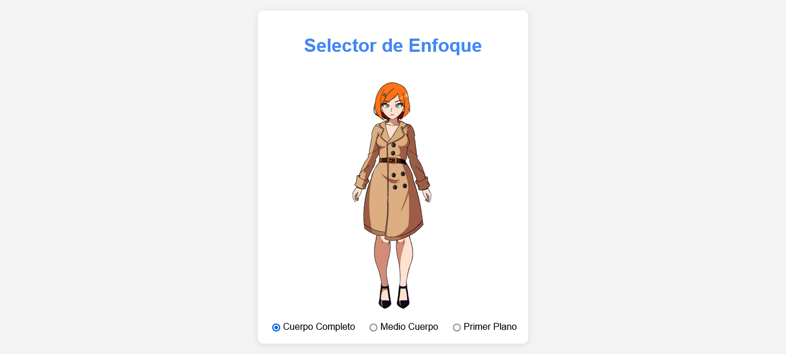
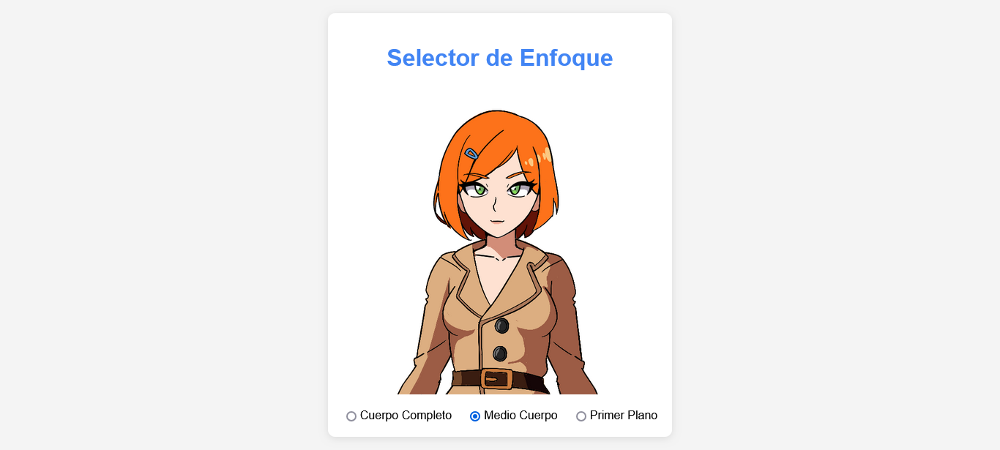
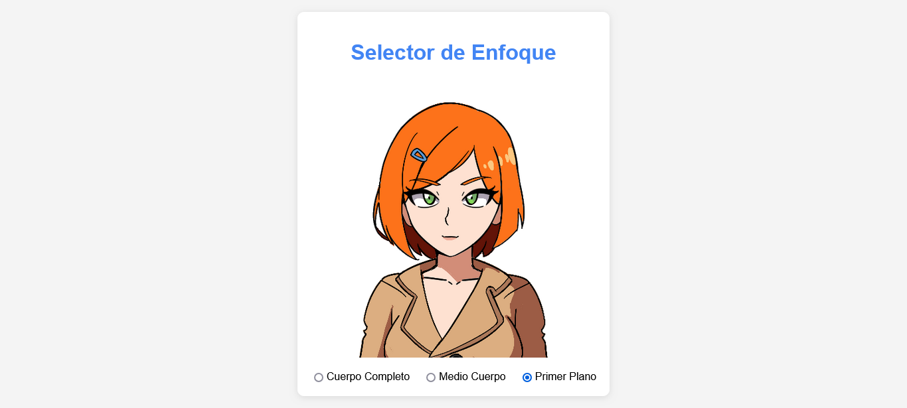

# FocusFrame

**FocusFrame** es una aplicación web que te permite cambiar el enfoque de una imagen entre tres opciones: cuerpo completo, medio cuerpo y primer plano. Es una herramienta sencilla y útil para visualizar diferentes perspectivas de una imagen.

---

## Características

- **Cambio de enfoque**: Permite seleccionar entre tres modos de enfoque:
  - **Cuerpo completo**: Muestra la imagen completa.
  - **Medio cuerpo**: Enfoca desde el torso hacia arriba.
  - **Primer plano**: Enfoca la cara.
- **Interfaz intuitiva**: Diseño simple y fácil de usar.
- **Transiciones suaves**: Cambios de enfoque con animaciones fluidas.

---

## Cómo Usar

1. Abre la aplicación en tu navegador.
2. Selecciona una de las tres opciones de enfoque:
   - **Cuerpo completo**
   - **Medio cuerpo**
   - **Primer plano**
3. Observa cómo la imagen se ajusta automáticamente al enfoque seleccionado.

---

## Tecnologías Utilizadas

- **HTML**: Estructura de la página.
- **CSS**: Estilos y animaciones.
- **JavaScript**: Lógica para cambiar el enfoque de la imagen.

---

## Instalación

No es necesario instalar nada. Simplemente abre el archivo `index.html` en tu navegador.

---

## Capturas de Pantalla

  
*Modo: Cuerpo Completo*

  
*Modo: Medio Cuerpo*

  
*Modo: Primer Plano*

---

## Contribuir

Si deseas contribuir a este proyecto, sigue estos pasos:

1. Haz un fork del repositorio.
2. Crea una rama para tu contribución (`git checkout -b feature/nueva-funcionalidad`).
3. Realiza tus cambios y haz commit (`git commit -m 'Añadir nueva funcionalidad'`).
4. Haz push a la rama (`git push origin feature/nueva-funcionalidad`).
5. Abre un Pull Request.

---

## Licencia

Este proyecto está bajo la licencia MIT. Consulta el archivo [LICENSE](LICENSE) para más detalles.

---

## Autor

- **Feith Noir**  
  Desarrollador, Artista y entusiasta de la tecnología.  
  [GitHub](https://github.com/tuusuario) | [Twitter](https://twitter.com/tuusuario)

---

## Agradecimientos

- Gracias a [Nunito](https://fonts.google.com/specimen/Nunito) por la fuente utilizada en este proyecto.
- Inspirado en herramientas de edición de imágenes y enfoque visual.